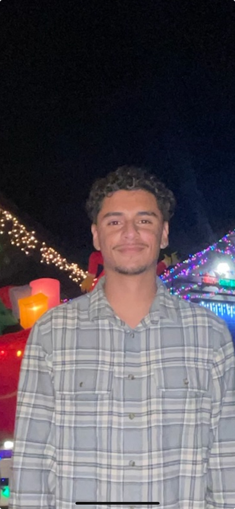

# David De Santiago
## Computer Engineering Student at the University of California, San Diego

 <!-- If the image is in the root directory -->

Welcome to my GitHub user page! I'm a third-year Computer Engineering student with a passion for software development and problem solving.

### Contact Information
- **Email:** [ddesantiago@ucsd.edu](mailto:ddesantiago@ucsd.edu)
- **LinkedIn:** [david-de-santiago](https://www.linkedin.com/in/david-de-santiago-a485b4240)

### Personal Projects
1. [**Goldberg Device (Arduino)**](#goldberg-device-arduino) - Designed and programmed a Rube Goldberg machine using an Arduino.
2. [**Snake Game (Java)**](#snake-game-java) - Developed a classic Snake Game with various difficulty levels and sound effects.
3. [**TicTacToe (Java)**](#tictactoe-java) - Created a TicTacToe game with an AI opponent.
4. **Morse Translate (JavaScript Program)** - I developed a JavaScript program capable of translating plain text into Morse code. This project allowed me to deepen my understanding of JavaScript's object-oriented features and gave me the opportunity to work with string manipulation and data structures. Below is a brief overview of the program's functionality:

    ```javascript
    /* Make a string turn into morse code */
    var morseCode = {
      'a': '.-', 'b': '-...', /* More mappings */
    };

    function toMorseCode(str) {
      var result = '';
      for (var i = 0; i < str.length; i++) {
        var char = str[i].toLowerCase();
        if (morseCode[char]) {
          result += morseCode[char] + ' ';
        }
      }
      return result.trim();
    }
    ```
    For more details, see [Morse Translate on GitHub](https://github.com/ddesantiag0/CSE110_LAB1_Week1/blob/main/morsetranslate.js). <!-- Update this link to point to the actual file -->

### Skills
`Python`, `Java`, `C`, `JavaScript`, `C++`

### Quoting Text
> "To improve is to change; to be perfect is to change often." - Winston Churchill

### External Links
- Check out my [LinkedIn](https://www.linkedin.com/in/david-de-santiago-a485b4240) profile.

### Section Links
- [Contact Information](#contact-information)
- [Personal Projects](#personal-projects)
- [Skills](#skills)

### Lists

#### Unordered List
- Artificial Intelligence
- Machine Learning
- Robotics

#### Ordered List
1. Complete the personal user page on GitHub
2. Update LinkedIn profile
3. Start a new project on machine learning

### Task List
- [x] Attend UCSD Computer Engineering classes
- [ ] Graduate with a Bachelor's degree in Computer Engineering
- [ ] Secure a software engineering position

---

[Go back to README](README.md)
